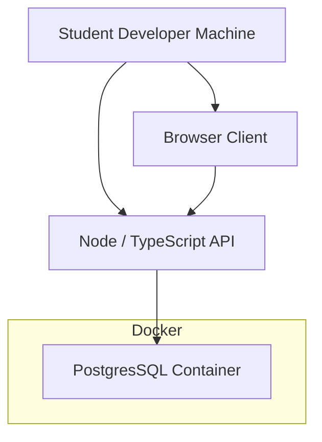

```mermaid
flowchart TD

    Developer["Student Developer Machine"]

    subgraph Docker
        PG["PostgresSQL Container"]
    end

    API["Node / TypeScript API"]
    Client["Browser Client"]

    Developer --> API
    Developer --> Client
    API --> PG
    Client --> API
```

